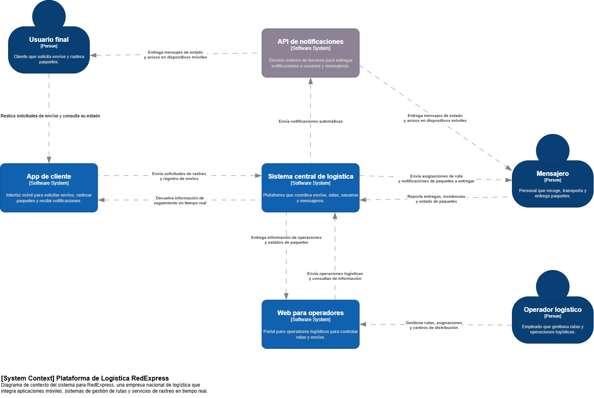

# 🗒️ Registro de Trabajo en Clase - Taller 3

## 📆 Fecha de la sesión
_30/08/2025_

## 👥 Integrantes presentes
- Juan David Cetina Gómez
- Ana Lucía Quintero Vargas
- Mariana Salas Gutiérrez

## 🧠 Actividades realizadas en clase

Durante una corta parte de la sesión el grupo se enfocó en organizar la forma de trabajo y distribuir las responsabilidades entre los integrantes del equipo. Engeneral, se alcanzó a revisar el caso de referencia de la plataforma de logística de RedExpress y a discutir los elementos que se debían representar en los diagramas de las vistas C1 (contexto) y C2 (contenedores), para que según los roles de cada persona se continue con la actividad fuera del aula.

- ¿Qué se discutió con el equipo?
  Durante la sesión, el equipo conversó principalmente sobre cómo se relacionaban los actores y los componentes del caso de RedExpress. Ya contábamos con la información básica sobre los elementos, pero nos correspondía definir de manera conjunta cuáles eran las conexiones y cómo representarlas en los diagramas.
- ¿Qué decisiones de modelado se tomaron?
  Se decidió mantener los colores predeterminados de draw.io para facilitar la lectura: azul oscuro para los actores, gris/café para los elementos externos y celeste para los sistemas internos de software. De esta manera, el diagrama quedó más organizado y comprensible para todos.
- ¿Qué herramientas se usaron (papel, pizarra, draw.io, Astah)?
  La herramienta principal fue draw.io, ya que permite trabajar de forma colaborativa en línea. Además, se tomó como apoyo la información disponible en la página oficial de C4 (c4model.com), que sirvió de referencia para aclarar dudas sobre la representación de algunos elementos.
- ¿Qué parte del trabajo se alcanzó a desarrollar?
  Debido al tiempo limitado, en clase únicamente se logró definir y delimitar las relaciones entre los elementos y actores. La construcción completa del diagrama quedó asignada como tarea para continuar y finalizar fuera del aula.

## 🧩 Boceto inicial del modelo

## 🔁 Tareas definidas para complementar el taller

Anote las responsabilidades acordadas entre los miembros del equipo para completar la entrega final:

| Tarea asignada | Responsable | Fecha estimada |
|----------------|-------------|----------------|
| Modelado final en draw.io | Mariana Salas Gutiérrez y Ana Lucía Quintero Vargas | 02/09 |
| Redacción del informe     | Mariana Salas Gutiérrez | 06/09 |
| Investigación y referencias | Juan David Cetina Gómez| 06/09 |

---

_Este documento resume el trabajo colaborativo realizado durante la sesión del taller 3 en el curso AREM - Universidad de La Sabana._
