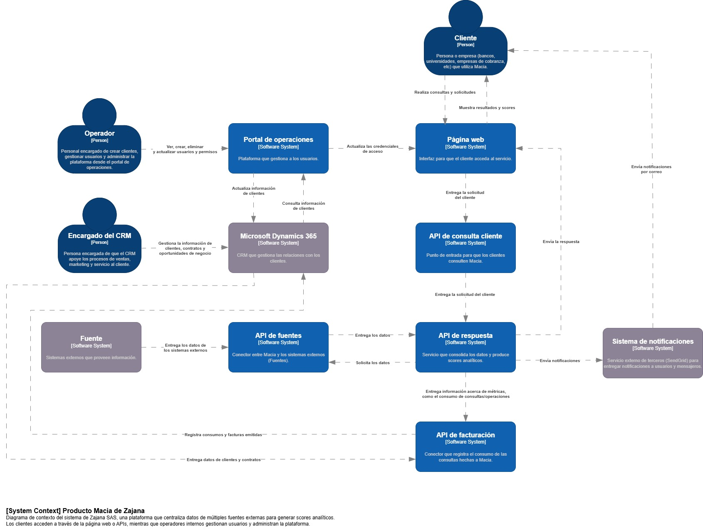
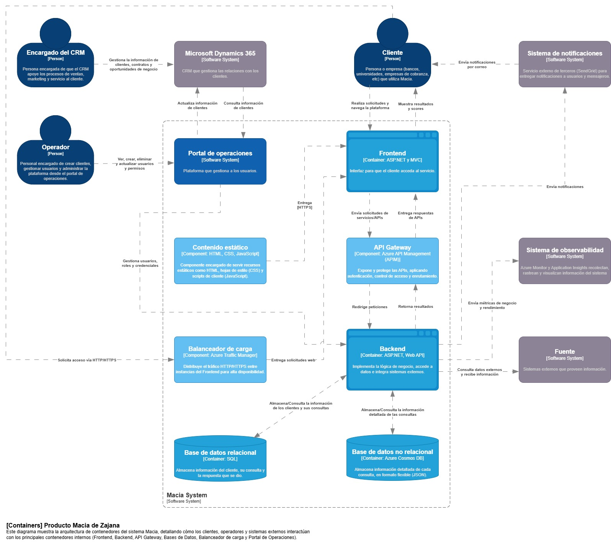

# 📄 Informe Técnico del Taller

## 🔖 ARQUITECTURA C4
_Taller 3 - Arquitectura Actual del Sistema con el Modelo C4_

## 👥 Integrantes del equipo
- Juan David Cetina Gómez (juancego@unisabana.edu.co)
- Ana Lucía Quintero Vargas (anaquiva@unisabana.edu.co)
- Mariana Salas Gutiérrez (marianasalgu@unisabana.edu.co)

## 🧠 Descripción general del trabajo
El taller tuvo como propósito aprender y aplicar el modelo C4, trabajando inicialmente con el caso de RedExpress y, posteriormente, adaptando lo aprendido a la empresa seleccionada, Zajana S.A.S. En el grupo se discutió principalmente cómo debían establecerse las relaciones entre los actores y los componentes, ya que los elementos estaban definidos previamente. Se decidió utilizar la herramienta draw.io por su facilidad para el trabajo colaborativo, manteniendo la paleta de colores predeterminada (azul oscuro para actores, gris/café para externos y celeste para sistemas internos) y complementando con la información de la página oficial de C4. El desarrollo se realizó en dos fases: En la clase se identificaron los actores y sistemas y se delimitaron sus relaciones, y como trabajo independiente se completó el trabajo, detallando los contenedores y elementos adicionales para los diagramas, esto con la validación de la información proporcionada por el contacto de la empresa.

## 🔧 Proceso de desarrollo
El trabajo se llevó a cabo de manera colaborativa utilizando la herramienta draw.io, que permitió a los integrantes aportar y realizar ajustes en tiempo real. La primera decisión fue modelar a los actores principales y, a partir de ellos, identificar los sistemas involucrados para construir el diagrama de contexto (C1). Posteriormente, tomando como base esa estructura inicial, se avanzó en el diagrama de contenedores (C2), donde se incluyeron sistemas externos, contenedores internos, bases de datos y otros componentes necesarios para delimitar el sistema. A lo largo del proceso, la información fue ajustada conforme se recibían aclaraciones del contacto de la empresa, lo que permitió que los diagramas reflejaran de manera más fiel la arquitectura actual del sistema.

## 🧩 Análisis del modelo propuesto
Incluya un análisis sobre:
- Cómo se estructura el modelo entregado
- Cómo representa las necesidades del cliente
- Qué supuestos se tomaron

## 📈 Diagrama final entregado

## 📋 Tabla de actores, entidades o componentes (si aplica)

La tabla para C1 aplicado a Zajana SAS es la siguiente:

| **Nombre del elemento** | **Tipo** | **Descripción** | **Responsable** |
|---------------------|------|-------------|-------------|
| **Cliente**        | Actor (Person) | Persona o empresa (ej. bancos, entidades de crédito) que consulta información y solicita scores. | Cliente |
| **Operador**        | Actor (Person) | Personal interno encargado de crear clientes, gestionar usuarios y administrar la plataforma. | Zajana |
| **Encargado del CRM**        | Actor (Person) | Persona encargada de que el CRM apoye los procesos de ventas, marketing y servicio al cliente. | Zajana |
| **Fuente**        | Componente (External Software System) | Sistemas externos que proveen información utilizada por Zajana (ej. registros, bases de datos). | Externo |
| **Página web**        | Componente (Software System) | Interfaz que permite al cliente acceder al servicio, realizar consultas y recibir respuestas. | Zajana |
| **Portal de operaciones**        | Componente (Software System) | Plataforma interna que usan los operadores para crear y administrar clientes y usuarios. | Zajana |
| **API de consulta cliente**        | Componente (Software System) | SPunto de entrada para solicitudes de clientes hacia Zajana (consultas de scores, datos). | Zajana |
| **API de fuentes**       | Componente (Software System) | Conector entre Zajana y los sistemas externos (Fuentes) para obtener datos necesarios. | Zajana |
| **API de facturación**       | Componente (Software System) | Registra el consumo de consultas y operaciones hechas en Zajana, base para facturación a clientes. | Zajana |
| **Sistema de notificaciones** | Componente (External Software System) | Servicio que envía notificaciones por correo a clientes, informando sobre la disponibilidad de scores, cambios en el estado de consultas o similares. | Externo |
| **CRM (Microsoft Dynamics 365)** | Componente (External Software System) | Sistema de gestión de relaciones con clientes que centraliza información comercial, contratos y oportunidades de negocio. | Externo |

La tabla para C2 aplicado a Zajana SAS es la siguiente:

| **Nombre del elemento** | **Tipo** | **Descripción** | **Responsable** |
|---------------------|------|-------------|-------------|
| **Cliente**        | Actor (Person) | Persona o empresa (ej. bancos, entidades de crédito) que consulta información y solicita scores. | Cliente |
| **Operador**        | Actor (Person) | Personal interno encargado de crear clientes, gestionar usuarios y administrar la plataforma. | Zajana |
| **Encargado del CRM**        | Actor (Person) | Persona encargada de que el CRM apoye los procesos de ventas, marketing y servicio al cliente. | Zajana |
| **Frontend**               | Contenedor (ASP.NET MVC) | Interfaz web para clientes, sirve vistas y comunica solicitudes al API Gateway. | Zajana |
| **Contenido estático**     | Contenedor (HTML, CSS, JS) | Sirve recursos estáticos (HTML, CSS, JS) para la renderización de la interfaz web. | Zajana |
| **Balanceador de carga**   | Componente (Azure Traffic Manager) | Distribuye el tráfico HTTP/HTTPS entre las instancias del Frontend para alta disponibilidad. | Azure (Externo) |
| **API Gateway**            | Contenedor (Azure API Management) | Expone y protege las APIs, aplicando autenticación, control de acceso y enrutamiento hacia el Backend. | Zajana / Azure |
| **Backend**                | Contenedor (ASP.NET Web API) | Implementa la lógica de negocio, procesa solicitudes, integra datos externos y accede a las bases de datos. | Zajana |
| **Base de datos relacional** | Contenedor (SQL Database) | Almacena información estructurada: clientes, consultas y respuestas. | Zajana |
| **Base de datos no relacional** | Contenedor (Cosmos DB) | Almacena información detallada de las consultas en formato flexible (JSON). | Zajana |
| **Portal de operaciones**  | Contenedor (Web App interna) | Herramienta interna para que operadores gestionen clientes, usuarios y credenciales. | Zajana |
| **CRM (Microsoft Dynamics 365)** | Sistema externo | Gestiona relaciones comerciales, contratos y oportunidades de negocio. | Microsoft / Zajana (uso) |
| **Sistema de notificaciones** | Sistema externo | Envía correos y alertas automáticas a clientes (ej. SendGrid). | Externo |
| **Sistema de observabilidad** | Sistema externo (Azure Monitor / App Insights) | Recolecta métricas, logs y trazas de Frontend, Backend y APIs para análisis y monitoreo. | Azure |
| **Fuente externa de datos** | Sistema externo | Sistemas externos que entregan datos usados en los procesos de análisis y scoring. | Externo |

## 🔍 Investigación complementaria
### Tema investigado:
Togaf vs C4
### Resumen:
TOGAF (The Open Group Architecture Framework) es reconocido como el marco de arquitectura empresarial más popular a nivel mundial, siendo considerado por The Open Group como el estándar de arquitectura empresarial más prominente y fiable [1]. Originalmente fue concebido como una metodología consistente con un Método de Desarrollo de la Arquitectura que describe los pasos para crear una arquitectura y un Marco de Contenido de la Arquitectura que detalla cómo debería lucir la arquitectura final [1][2]. Sin embargo, se ha redefinido y reposicionado como un "toolkit" debido a la impracticabilidad de su método detallado en la realidad [2]. En la práctica, se observa que ni el ADM ni una parte significativa de los documentos recomendados por el ACF son seguidos por los arquitectos, quienes los encuentran demasiado rígidos e imprácticos [1][2]). Por otro lado, el Modelo C4 fue creado para simplificar la documentación arquitectónica frente a la complejidad de los diagramas tradicionales [3]. Propone un enfoque jerárquico de cuatro niveles de abstracción (Contexto, Contenedor, Componente y Código), cada uno con un enfoque específico, facilitando la comunicación entre stakeholders [3].

En comparación, TOGAF ha mostrado en estudios de caso una adopción mínima de sus recomendaciones clave, siendo las pocas ideas útiles que se implementan (como la separación en cuatro dominios o el uso de principios) no específicas de TOGAF, sino conceptos de sentido común preexistentes en EA [1][2]. En contraste, el Modelo C4 se presenta como un enfoque que complementa frameworks de EA como TOGAF al ofrecer una representación visual clara y personalizable de la arquitectura en diferentes niveles, facilitando la alineación de las decisiones arquitectónicas con los objetivos de negocio [3]. Donde TOGAF es criticado por su origen y la ausencia de ejemplos documentados de implementación exitosa [1][2], el Modelo C4 destaca por su capacidad de mejorar la comunicación, reducir malentendidos y respaldar una toma de decisiones arquitectónica más efectiva en aplicaciones reales, con múltiples organizaciones reportando su éxito [3].

Esta comparación presentada puede ayudar a entender el enfoque del taller. Mientras TOGAF se centra en ofrecer un marco metodológico amplio para la arquitectura empresarial, en la práctica suele resultar complejo y poco aplicado en su totalidad. Mientras que, el modelo C4 propone una forma más clara y práctica de representar arquitecturas a través de niveles de abstracción que facilitan la comunicación entre actores técnicos y no técnicos. Justamente en el taller se aplicó este enfoque, ya que los diagramas C1 y C2 permitieron representar de manera sencilla la arquitectura de RedExpress y luego de Zajana S.A.S., mostrando cómo los actores se relacionan con los sistemas y contenedores sin necesidad de recurrir a procesos demasiado complejos.

## 📚 Referencias

[1] S. Kotusev, “TOGAF-based Enterprise Architecture Practice: An Exploratory Case Study,” Communications of the Association for Information Systems, vol. 43, no. 20, Sept. 2018.

[2] S. Kotusev, “The critical scrutiny of TOGAF,” BCS, The Chartered Institute for IT, Apr. 2016. [En línea]. 

[3] J. Wasielewski, “The C4 Model in Enterprise Architecture explained,” ValueBlue, Abr. 2025. [En línea]. 

_Este documento hace parte de la entrega del taller 3 del curso AREM (Arquitectura Empresarial) - Universidad de La Sabana._
